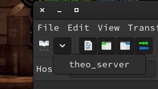

# FTP documentation
## Purpose of the tool
- Having an ftp service set up on a server allows users to access their files and upload new ones, from any device, using any ftp client they prefer
## Connecting to the ftp server with Filezilla
- Filezilla is a well-featured ftp client/server.
  - You can install it and finds the docs at https://filezilla-project.org/
- We are using the fstp protocol, not exactly the ftp protocol, so we have to configure for that in filezilla.
  1. Go to File>Site Manager. If you don't have any site in the list, create a new one.
  2. Choose the SFTP protocol.
  3. In "Host", put the server's ip address
  4. Use the same port as usual (you know...)
  5. Let "Logon Type" on Normal, and for user/password, enter the credentials of the server's user you want to connect with.
- Then click ok to save this info.
- Then you can connect to your server by selecting it's name in the top-left corner of rner of filezilla's interface
- 
